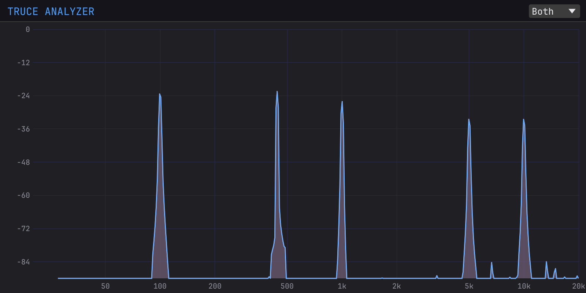

# Truce Analyzer

A real-time frequency spectrum analyzer audio plugin built with [truce](https://github.com/truce-audio/truce).

Uses a **Constant-Q Transform (CQT)** for logarithmically-spaced frequency resolution — each bin has bandwidth proportional to its center frequency, matching how we perceive pitch. GPU-accelerated rendering via [egui](https://github.com/emilk/egui) + wgpu (Metal/DX12/Vulkan).



## Features

- CQT-based analysis with 48 bins per octave (27.5 Hz – 20.48 kHz)
- Sparse frequency-domain kernels (Brown-Puckette method) for efficient real-time computation
- Channel mode selector: Left, Right, Sum, Diff, or Both (stereo overlay)
- Lock-free audio-to-GUI data transfer via atomics
- Logarithmic frequency axis, dB amplitude axis
- Filled spectrum curve with hover crosshair showing frequency and amplitude
- GPU-accelerated rendering via egui-wgpu
- Pass-through audio with adjustable gain

## Plugin Formats

Builds to all five formats by default: CLAP, VST3, VST2, AU, and AAX.

AAX requires the Avid AAX SDK. Set the path in `.cargo/config.toml`:

```toml
[env]
AAX_SDK_PATH = "/path/to/aax-sdk"
```

## Development

```sh
cargo build                                     # debug build
cargo test                                      # run tests
cargo truce install --dev --release             # install hot-reload shell
cargo watch -x build                            # iterate with hot-reload
```

## Project Structure

```
src/
  lib.rs    — plugin definition, egui UI, spectrum rendering
  core.rs   — CQT engine, SpectrumData, coordinate helpers
```

## License

Licensed under either of [Apache License, Version 2.0](LICENSE-APACHE) or [MIT License](LICENSE-MIT) at your option.
