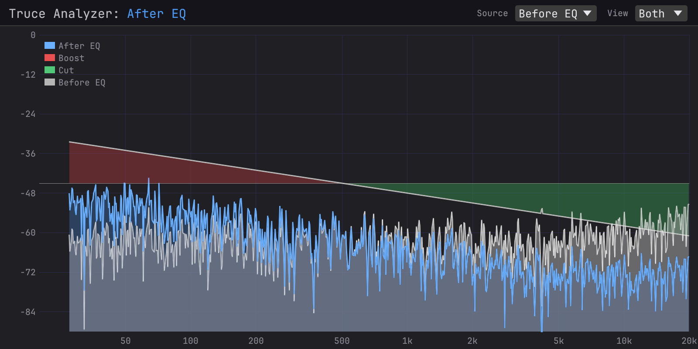

# Truce Analyzer

A real-time frequency spectrum analyzer audio plugin built with [truce](https://github.com/truce-audio/truce). Designed for A/B comparison — place multiple instances across your signal chain and visually diff the spectral impact of your processing.

Uses a **Constant-Q Transform (CQT)** for logarithmically-spaced frequency resolution with 96 bins per octave — each bin has bandwidth proportional to its center frequency, matching how we perceive pitch. GPU-accelerated rendering via [egui](https://github.com/emilk/egui) + wgpu (Metal/DX12/Vulkan).

### Spectrum View


### A/B Comparison



The diff view shows the spectral difference between two instances: red = boost (local louder), green = cut (source louder). Here, a -3 dB/octave tilt EQ is applied — the "After EQ" signal (blue) tilts down from left to right while "Before EQ" (gray) stays flat.

## Features

### Analysis
- CQT-based analysis with 96 bins per octave (27.5 Hz – 20.48 kHz, ~916 bins)
- Sparse frequency-domain kernels (Brown-Puckette method) for efficient real-time computation
- Background kernel generation — never blocks the audio thread or host initialization
- Lock-free audio-to-GUI data transfer via atomics
- Sub-pixel point decimation for efficient rendering with high bin counts

### Multi-Instance A/B Comparison
- Select other instances as sources and overlay their spectra
- Three view modes: Normal (overlay), Diff (deviation from source), Both (overlay + diff)
- Version-matched diffing eliminates timing artifacts between instances
- Per-remote diff curves when comparing against multiple sources
- Cross-process shared memory (named mmap) — works across AU v3 and AAX process boundaries
- File-based cross-process registry with PID-based stale cleanup

### Interface
- Editable instance names (double-click to rename, persists across save/load)
- Color-coded legend mapping signals to curves
- Multiline hover tooltip with frequency, amplitude per source, and diff readout — auto-flips when near edges
- Channel selector: Sum, Both (L+R overlay), Left, Right, Diff (M/S side) — auto-hidden when comparing sources
- View and Source dropdowns with labels
- Pass-through audio with adjustable gain
- 30fps repaint cap to reduce GPU load with multiple instances

## Plugin Formats

Builds to all five formats by default: CLAP, VST3, VST2, AU, and AAX.

AAX requires the Avid AAX SDK. Set the path in `.cargo/config.toml`:

```toml
[env]
AAX_SDK_PATH = "/path/to/aax-sdk"
```

## Development

```sh
cargo build                                     # debug build
cargo test                                      # run tests
cargo truce install --dev --release             # install hot-reload shell
cargo watch -x build                            # iterate with hot-reload
```

## Project Structure

```
src/
  lib.rs        — plugin, parameters, EditorUi impl, egui rendering
  core.rs       — CQT engine (SpectrumData, AnalyzerCore, coordinate helpers)
  registry.rs   — process-global instance registry (LazyLock + Mutex)
  shmem.rs      — SpectrumSource trait, cross-process shared memory (mmap), file registry
  ui_state.rs   — GUI state (UiState, RemoteCache, PersistentState, ViewMode)
docs/
  constants.md          — all tunable constants and derived values
  spectral-leakage.md   — CQT leakage behavior and mitigation
  design.md             — original design doc
  design-multi-instance.md — multi-instance communication architecture
```

## License

Licensed under either of [Apache License, Version 2.0](LICENSE-APACHE) or [MIT License](LICENSE-MIT) at your option.
