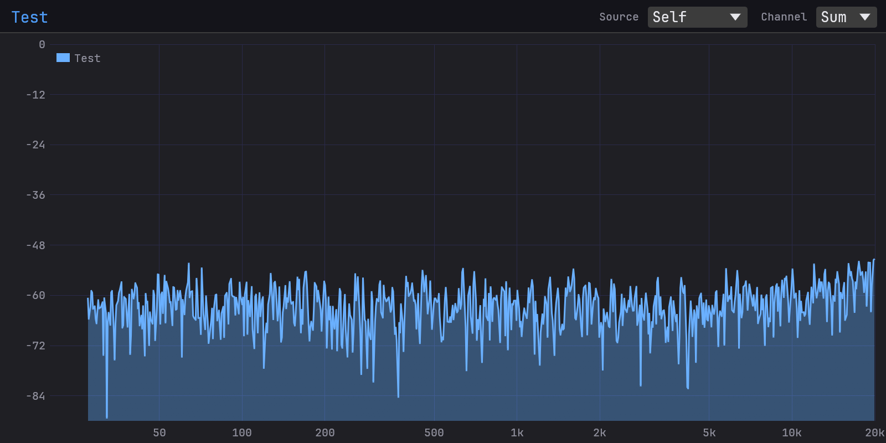
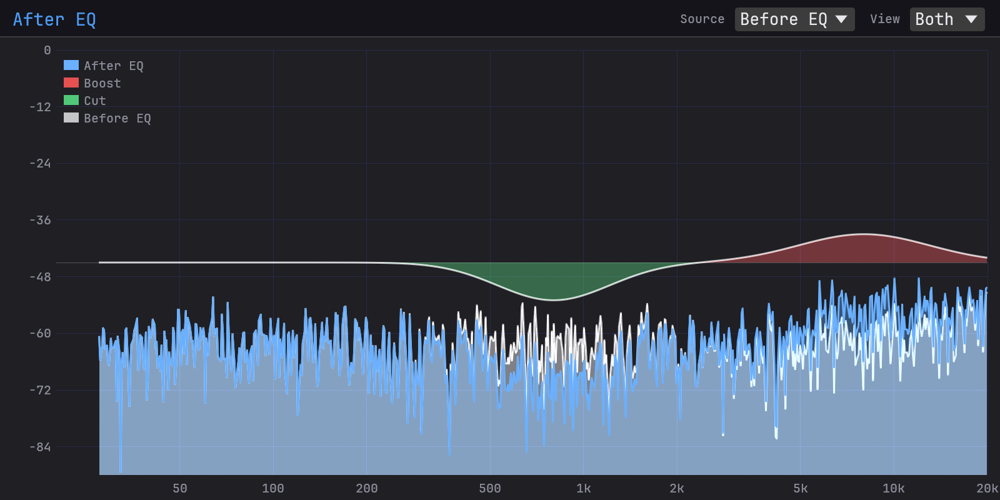

# Truce Analyzer

**[Download the latest release](https://github.com/truce-audio/truce-analyzer/releases/latest)** — `.pkg` for macOS, `.exe` for Windows, `.tar.gz` for Linux. Ships CLAP and VST3 on every platform, plus AU v2 on macOS and LV2 on Linux. AU v3 and AAX are opt-in per build (Developer ID signing and PACE/iLok signing respectively).

A real-time frequency spectrum analyzer plugin for debugging/reverse-engineering audio plugins. 

Compare signals across your chain without needing additional tracks or sends. Insert one instance before your processing and one after, then select the "before" instance as a source in the "after" instance.

- **Red** = boost (your processing added energy)
- **Green** = cut (your processing removed energy)
- **Gray** = the source signal overlaid for reference

Three view modes:
- **Normal** — overlay the source spectrum behind yours
- **Diff** — show only the difference
- **Both** — overlay + diff together (shown above)

You can also select multiple sources to compare against several points in your chain at once.

## License

Licensed under either of [Apache License, Version 2.0](LICENSE-APACHE) or [MIT License](LICENSE-MIT) at your option.
